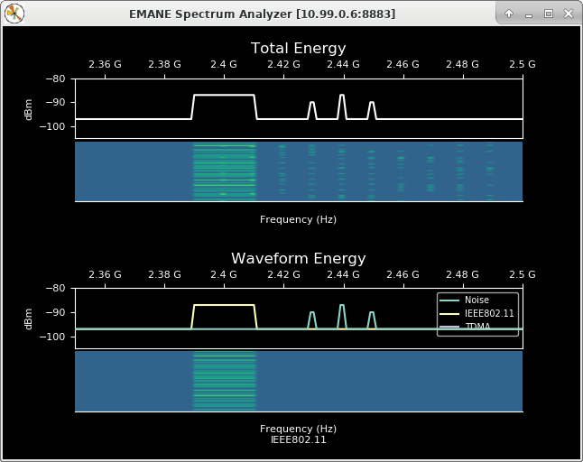

emane-spectrum-tools
==

The emane-spectrum-tools project contains utilities to monitor the
[EMANE][1] over-the-air (OTA) channel:

1. `emane-spectrum-monitor`: EMANE over-the-air (OTA) monitoring
   application, can either be configured with the same NEM id and
   physical layer settings as an existing experiment node in order to
   monitor that node's view of the spectrum, or it can be configured
   with a unique NEM id and added to a scenario via location and/or
   pathloss events to create a passive listener.

2. `emane-spectrum-analyzer`: A spectrum analyzer view of energy
   measurements published by `emane-spectrum-monitor` instances.

[1]: https://github.com/adjacentlink/emane

#  emane-spectrum-monitor

`emane-spectrum-monitor` uses a modified version of the emulator
physical layer to monitor spectrum energy visible on any frequency by
a respective NEM. Instances of `emane-spectrum-monitor` publish per
physical layer subid measurement bins of spectrum energy via a
[ZeroMQ][2] Pub socket.

[2]: https://zeromq.org

`emane-spectrum-monitor` instances can execute on any experiment
system, provided the running instances have access to the same OTA
channel and event channel as other NEM instances in the
experiment. This allows for monitoring without interfering with
resources dedicated to other NEM instances, provided you have assigned
resources such as CPU cores accordingly.

`emane-spectrum-monitor` can be configured via command line options or
an XML configuration file.  See `emane-spectrum-monitor -h` for more
information.


# Example experiment

letce2-tutorial [exp-04][3] contains 5 IEEE 802.11abg nodes and 5
[TDMA][4] nodes. The [IEEE 802.11abg][5] nodes are tuned to
2.4GHz. The TDMA nodes use 10 frequencies that are separated by 10MHz
starting at 2.4GHz. *node-6* is configured to run
`emane-spectrum-monitor`.

Below is the `emane-spectrum-monitor` configuration used in exp-04. In
this experiment, the spectrum monitor is using the same configuration
as NEM 6 in order to provide the same spectrum view.

[3]: https://github.com/adjacentlink/letce2-tutorial/tree/master/exp-04
[4]: https://github.com/adjacentlink/emane/wiki/TDMA-Model
[5]: https://github.com/adjacentlink/emane/wiki/IEEE-802.11abg-Model

```xml
<emane-spectrum-monitor id="6">
  <emulator>
      <param name="otamanagerchannelenable" value="on"/>
      <param name="otamanagerdevice" value="backchan0"/>
      <param name="otamanagergroup" value="224.1.2.8:45702"/>
      <param name="eventservicegroup" value="224.1.2.8:45703"/>
      <param name="eventservicedevice" value="backchan0"/>
  </emulator>
  <physical-layer>
    <param name="bandwidth" value="20M"/>
  </physical-layer>
</emane-spectrum-monitor>
```

See `emane-spectrum-monitor -h` for a full listing of configuration
options. Below is a sample command line for executing
`emane-spectrum-monitor`.

```
emane-spectrum-monitor \
    --config emane-spectrum-monitor.xml \
    -r \
    -d \
    -l 3 \
    -f /persist/node-6/var/log/emane-spectrum-monitor.log \
    --pidfile /persist/node-6/var/run/emane-spectrum-monitor.pid \
    --uuidfile /persist/node-6/var/run/emane-spectrum-monitor.uuid
```

# emane-spectrum-analyzer

`emane-spectrum-analyzer` is a [Matplotlib][6] application that
subscribes to an `emane-spectrum-monitor` instance's spectrum energy
measurement stream and uses [Pandas][7] to process and display the
total spectrum energy experienced over a specified frequency range
along with a waterfall history view.

[6]: https://matplotlib.org
[7]: https://pandas.pydata.org

Additional command line arguments can be used to specify a secondary
receive energy view that displays spectrum energy per physical layer
subid (waveform) along with a selectable per subid waterfall history
view.



Below is a sample command line for executing `emane-spectrum-analyzer`
for viewing *node-6*'s measurement stream in exp-04. The
`--subid-name` option can by used to provide waveform labels when
using `--with-waveforms` to display the secondary per subid receive
energy view. See `emane-spectrum-analyzer -h` for more details.

```
emane-spectrum-analyzer \
    node-6:8883 \
    --with-waveforms \
    --hz-min 2350000000 \
    --hz-max 2500000000 \
    --subid-name 7,TDMA \
    --subid-name 1,IEEE802.11
```

# Building emane-spectrum-tools 

The emane-spectrum-tools project uses internal and external emane
APIs. You will need to point to your current emane source tree using
the `emane_SRC_ROOT` environment variable as part of the build
process.

For example, if your emane-spectrum-tools and emane source trees are
in ~/dev:

```
$ cd ~/dev/emane-spectrum-tools
$ ./autogen.sh && ./configure emane_SRC_ROOT=~/dev/emane
```

For rpm based distributions:

```
$ make rpm
```

For deb based distributions:

```
$ make deb
```
